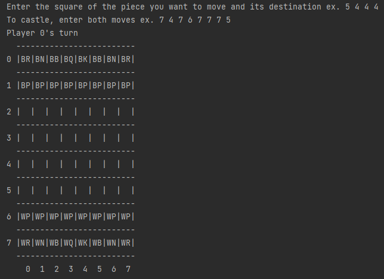

# Chess v2

Java version of chess you can run in your console. This project was a return to larger, object-oriented type project
that was built from the groud up using test-driven development.

## To run
Run Game.java in your favorite editor/environment. 

## Future implementation
Right now, input is pretty clunky, as users must input the starting and ending square for the piece
they want to move with no indication if the move is valid until after they attempt to make it.
Ideally, this would be solved with a GUI, as pieces could display on the board which moves are valid
after clicking on them. 

Attempted to create a .jar file, however, ran into issues and was unable to resolve them, so that is 
also something that can be improved. 

Finally, a stretch goal might be to create a basic chess AI to play agianst. 